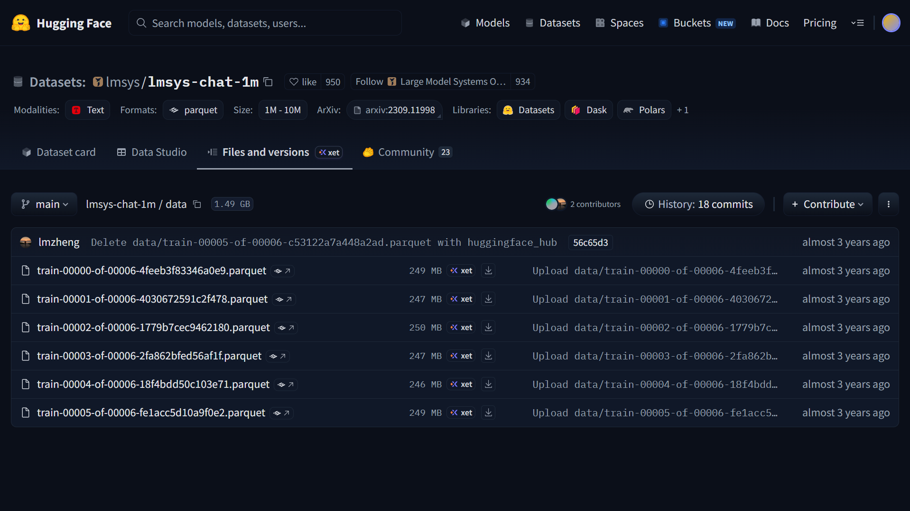

# LMSYS Chat 1M Dataset (Parquet Files)

Download all **6 Parquet files** from the Hugging Face dataset:

---

## Dataset

https://huggingface.co/datasets/lmsys/lmsys-chat-1m/tree/main/data

---

## Rename the downloaded files

After downloading, rename the files as follows:

| Original Order | New Filename |
| :------------: | :----------- |
| 1 | `train-01.parquet` |
| 2 | `train-02.parquet` |
| 3 | `train-03.parquet` |
| 4 | `train-04.parquet` |
| 5 | `train-05.parquet` |
| 6 | `train-06.parquet` |

> **Note:** Ensure the files are renamed in the same order they appear in the dataset.